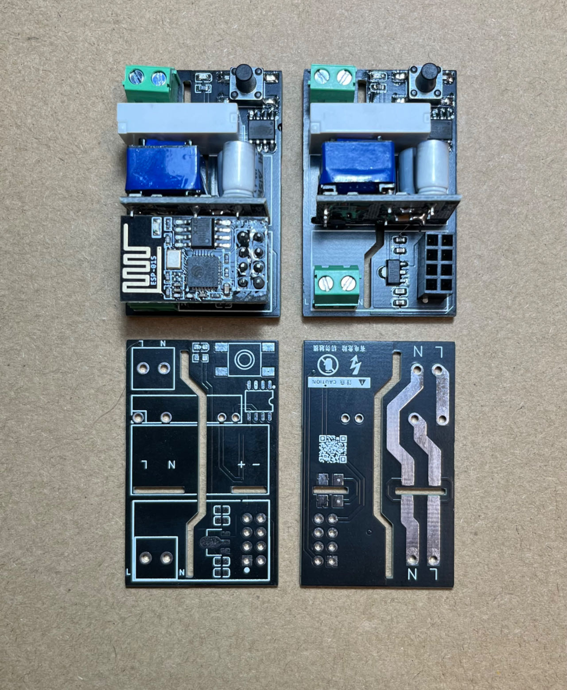
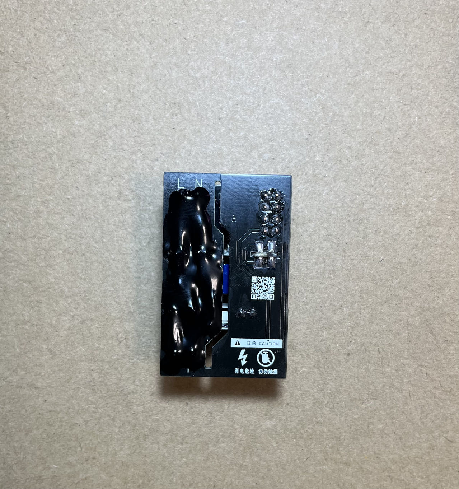

# HomeKit Relay

## Apple HomeKit 单路通断器固件
本固件是适用于个人设计的独立硬件。成本低于20，可以让非智能的单路控制灯光接入HomeKit。

## 成品图片

<!--  -->

## 注意事项

**强电危险，需谨慎！！！**

在焊接完成后，需要在零火线上堆锡，越厚越好，最好式贴铜条增加过流能力。

防止触摸强电需要在堆锡完成后覆盖一层阻焊光油，防止触电。

承载能力继电器标称规格**1250VA**，家用常规灯光无问题，电路的承载能力取决于堆锡的厚度，建议贴2.5平方的铜条。

**强切记不要尝试接入控制大功率电器！！！**

## 硬件购买

|名称|链接|备注|
|---|---|---|
|继电器|[购买链接](https://item.taobao.com/item.htm?abbucket=11&id=529388243415&ns=1&spm=a21n57.1.0.0.4977523ccVh2NJ&skuId=3906383879250)|型号：005-1H11 5VDC 1组常开4脚5A|
|AC-DC隔离电源|[购买链接](https://item.taobao.com/item.htm?_u=v2ce6adeb710&id=527538079756&skuId=3973098313023&spm=a1z09.2.0.0.7dae2e8dYGKD9l)|型号：5V 700MA高配|
|ESP-01S|[购买链接](https://item.taobao.com/item.htm?abbucket=11&id=40511001950&ns=1&spm=a21n57.1.0.0.64cb523ciD7WpU&skuId=3833808544302)|型号：ESP-01S|

其他硬件参考[bom表](./hardware/BOM.csv)即可

